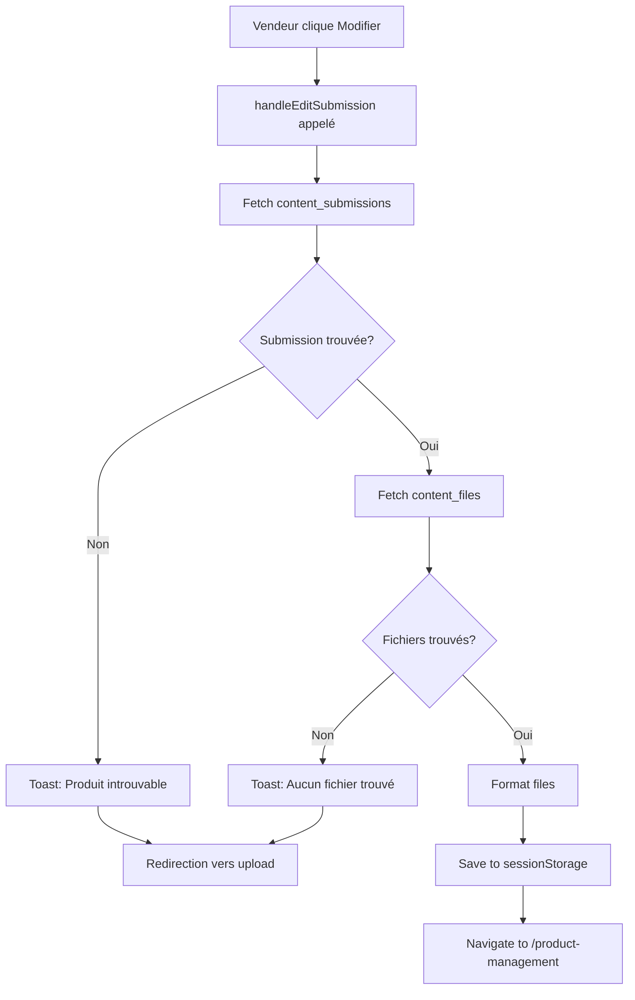

# Rapport de Débogage - Problème d'Accès aux Produits Vendeur

## Date: 2025-11-18

---

## 🔴 PROBLÈME PRINCIPAL

**Symptôme actuel**: Quand le vendeur clique sur "Modifier" un produit depuis son dashboard, il reçoit une notification "Produit non trouvé" et est redirigé vers la page d'upload.

**Symptômes précédents**: 
1. Le vendeur ne pouvait pas voir ses produits sur son dashboard (message "Aucun contenu uploadé pour le moment")
2. Les produits existent bien dans la base de données mais ne sont pas accessibles via l'interface

---

## 📋 CONTEXTE TECHNIQUE

### Architecture du Système

**Tables Supabase impliquées**:
- `content_submissions` - Contient les informations des produits
- `content_files` - Contient les fichiers associés aux produits
- `user_roles` - Définit les rôles utilisateur (admin, creator, client)

**Pages concernées**:
- `src/pages/Dashboard.tsx` - Dashboard vendeur
- `src/pages/ProductManagement.tsx` - Page de gestion/modification des produits
- `src/pages/SellerDashboard.tsx` - Wrapper avec protection d'accès

**Hooks impliqués**:
- `src/hooks/useSellerDashboard.tsx` - Gestion des données vendeur

---

## 🔧 MODIFICATIONS APPORTÉES

### Modification 1: Ajout de Logs de Débogage (useSellerDashboard.tsx)
**Fichier**: `src/hooks/useSellerDashboard.tsx`  
**Lignes**: 105-134

**Changements**:
```typescript
// Ajout de logs détaillés dans fetchSubmissions
console.log("📊 fetchSubmissions called");
console.log("👤 Current user:", user);
console.log("🔑 User ID:", user.id);

const { data, error } = await supabase
  .from('content_submissions')
  .select(`
    *,
    categories (
      id,
      name,
      slug
    ),
    content_files (*)
  `)
  .eq('creator_id', user.id)
  .order('created_at', { ascending: false });

console.log("📦 Submissions data:", data);
console.log("❌ Submissions error:", error);
console.log("📈 Number of submissions:", data?.length || 0);
```

**Objectif**: Identifier si le problème vient de la requête de récupération des submissions.

---

### Modification 2: Séparation des Requêtes (Dashboard.tsx)
**Fichier**: `src/pages/Dashboard.tsx`  
**Fonction**: `handleEditSubmission`  
**Lignes**: 63-132

**Changements**:

**AVANT** (requête unique avec JOIN):
```typescript
const { data: submission, error } = await supabase
  .from('content_submissions')
  .select(`
    *,
    content_files (*)
  `)
  .eq('id', submissionId)
  .single();
```

**APRÈS** (deux requêtes séparées):
```typescript
// 1. Récupération de la submission
const { data: submission, error: submissionError } = await supabase
  .from('content_submissions')
  .select('*')
  .eq('id', submissionId)
  .single();

if (submissionError) {
  console.error('❌ Error fetching submission:', submissionError);
  toast.error('Erreur lors du chargement du produit: ' + submissionError.message);
  return;
}

// 2. Récupération des fichiers séparément
const { data: contentFiles, error: filesError } = await supabase
  .from('content_files')
  .select('*')
  .eq('submission_id', submissionId);

if (filesError) {
  console.error('❌ Error fetching files:', filesError);
  toast.error('Erreur lors du chargement des fichiers: ' + filesError.message);
  return;
}
```

**Objectif**: Contourner d'éventuels problèmes RLS avec les JOINs.

---

## 🔒 POLITIQUES RLS ACTUELLES

### Table: content_submissions

**Politiques SELECT**:
1. ✅ `Admins can view all submissions` - Les admins voient tout
2. ✅ `Creators can view their submissions and admins all` - Les créateurs voient leurs propres submissions
3. ✅ `Public can view essential content info only` - Public voit uniquement les submissions approuvées

**Requête de la politique créateur**:
```sql
(creator_id = auth.uid()) OR has_role(auth.uid(), 'admin'::app_role)
```

### Table: content_files

**Politiques SELECT**:
1. ✅ `Admins can view all files`
2. ✅ `Creators can manage their submission files`
3. ✅ `Public can view file metadata for approved submissions`
4. ✅ `Public can view previews and thumbnails only`
5. ✅ `Users can access purchased original files`
6. ✅ `public_can_view_product_files`

**Requête de la politique créateur pour content_files**:
```sql
EXISTS (
  SELECT 1 FROM content_submissions
  WHERE content_submissions.id = content_files.submission_id
    AND content_submissions.creator_id = auth.uid()
    AND (has_role(auth.uid(), 'creator'::app_role) OR has_role(auth.uid(), 'admin'::app_role))
)
```

---

## 🐛 HYPOTHÈSES SUR LA CAUSE

### Hypothèse 1: Problème de Rôle Utilisateur
Le vendeur n'a peut-être pas le rôle `creator` correctement assigné dans `user_roles`.

**Test à faire**:
```sql
SELECT * FROM user_roles WHERE user_id = '[USER_ID]';
```

### Hypothèse 2: Problème de Foreign Key
La relation entre `content_submissions.id` et `content_files.submission_id` pourrait être rompue.

**Test à faire**:
```sql
SELECT cs.id, cs.title, cf.id as file_id, cf.file_name
FROM content_submissions cs
LEFT JOIN content_files cf ON cf.submission_id = cs.id
WHERE cs.creator_id = '[USER_ID]';
```

### Hypothèse 3: Problème de Session Auth
La session Supabase du vendeur pourrait ne pas avoir `auth.uid()` correctement défini.

**Test à faire**: Vérifier dans les logs console la valeur de `user.id` et `auth.uid()`.

### Hypothèse 4: RLS Bloque les JOINs
Les politiques RLS peuvent parfois bloquer les requêtes avec JOINs même si les requêtes séparées fonctionnent.

**Solution déjà tentée**: Séparation des requêtes (Modification 2).

---

## 📊 DONNÉES À COLLECTER

### Dans la Console du Navigateur
```
🔍 Loading submission for edit: [submission_id]
📦 Submission data: [objet submission]
📁 Content files: [array de fichiers]
```

### Dans Supabase (SQL Editor)
```sql
-- Vérifier le rôle du vendeur
SELECT ur.role, ur.created_at, p.email, p.display_name
FROM user_roles ur
JOIN profiles p ON p.user_id = ur.user_id
WHERE ur.user_id = '[USER_ID]';

-- Vérifier les submissions du vendeur
SELECT id, title, status, creator_id, created_at
FROM content_submissions
WHERE creator_id = '[USER_ID]';

-- Vérifier les fichiers liés
SELECT cf.id, cf.file_name, cf.submission_id, cs.title
FROM content_files cf
LEFT JOIN content_submissions cs ON cs.id = cf.submission_id
WHERE cs.creator_id = '[USER_ID]';

-- Tester directement la fonction has_role
SELECT has_role('[USER_ID]'::uuid, 'creator'::app_role);
```

---

## 🎯 PROCHAINES ÉTAPES

1. **Collecter les logs console** quand le vendeur clique sur "Modifier"
2. **Exécuter les requêtes SQL** ci-dessus pour vérifier l'intégrité des données
3. **Vérifier la session auth** du vendeur (userId, role)
4. **Tester avec un compte admin** pour voir si le problème persiste

---

## 📝 FLUX ACTUEL DE MODIFICATION



---

## 💡 SOLUTIONS POTENTIELLES

### Solution A: Vérifier et Réassigner le Rôle
```sql
-- Si le rôle est manquant
INSERT INTO user_roles (user_id, role)
VALUES ('[USER_ID]', 'creator')
ON CONFLICT (user_id) DO UPDATE SET role = 'creator';
```

### Solution B: Utiliser une Fonction RPC
Créer une fonction Supabase qui contourne les limitations RLS:
```sql
CREATE OR REPLACE FUNCTION get_submission_with_files(submission_id_param uuid)
RETURNS json
LANGUAGE plpgsql
SECURITY DEFINER
AS $$
DECLARE
  result json;
BEGIN
  SELECT json_build_object(
    'submission', (SELECT row_to_json(cs) FROM content_submissions cs WHERE cs.id = submission_id_param),
    'files', (SELECT json_agg(cf) FROM content_files cf WHERE cf.submission_id = submission_id_param)
  ) INTO result;
  
  RETURN result;
END;
$$;
```

### Solution C: Ajouter une Politique RLS Plus Permissive
```sql
CREATE POLICY "Creators can view all data for their submissions"
ON content_files FOR SELECT
USING (
  EXISTS (
    SELECT 1 FROM content_submissions
    WHERE content_submissions.id = content_files.submission_id
    AND content_submissions.creator_id = auth.uid()
  )
);
```

---

## 🔍 INFORMATIONS SYSTÈME

**Framework**: React + Vite  
**Base de données**: Supabase (PostgreSQL)  
**Authentification**: Supabase Auth  
**Client Supabase**: Version 2.55.0  
**RLS**: Activé sur toutes les tables

---

## 📞 INFORMATIONS DE CONTACT POUR DEBUG

**Fichiers à vérifier en priorité**:
- `src/pages/Dashboard.tsx` (ligne 63-132)
- `src/hooks/useSellerDashboard.tsx` (ligne 105-134)
- `src/integrations/supabase/types.ts` (policies RLS)

**Variables d'environnement**:
- `SUPABASE_URL`: https://kdgfpophpoqugtuvfxqx.supabase.co
- `SUPABASE_ANON_KEY`: eyJhbGciOiJIUzI1NiIsInR5cCI6IkpXVCJ9...

---

*Document généré le 2025-11-18 pour assistance au débogage*
